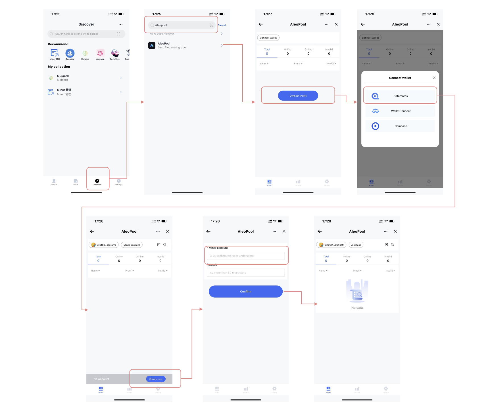
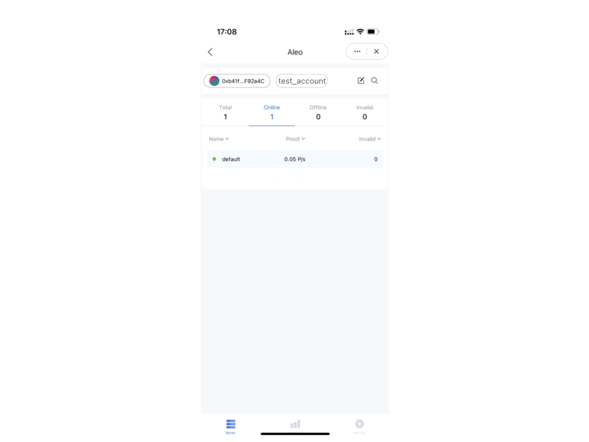

#### 一. 挖矿设备和环境
1. 系统要求：ubuntu 18.04

2. 硬件要求：

   GPU挖矿：建议至少16核cpu，需要安装最新显卡驱动，当前仅支持 NVIDIA 显卡

#### 二. 开通矿池

1. 方式一：登录网站 https://pool.zkmatrix.io/ 注册挖矿账户

2. 通过 Safematrix (https://safematrix.io/download) 发现页 ，搜索 aleo，打开并注册挖矿账户

   

#### 三. 下载miner（测试版）
- Ubuntu:  https://github.com/zkmatrixpool/aleo-pool-miner/raw/main/bins/aleo-miner-cuda_ubuntu1804
#### 四. 运行miner

1. cd 到 miner 程序文件所在目录

2. 添加执行权限

   ```shell
   chmod +x ./aleo-miner*
   ```

3. 运行 miner

- Ubuntu (单GPU)：

  ```shell
  # 请使用您注册的 account_name，miner_name 可随意填写
  ./aleo-miner-cuda_ubuntu1804 --pool 156.241.5.158:49155 --account_name test_account --miner_name test_miner
  ```

- Ubuntu (双GPU，每个GPU启动一个进程，通过CUDA_VISIBLE_DEVICES 环境变量控制当前进程使用的GPU)：

  ```shell
  # 请使用您注册的 account_name，miner_name 可随意填写
  export CUDA_VISIBLE_DEVICES=0 
  ./aleo-miner-cuda_ubuntu1804 --pool 156.241.5.158:49155 --account_name test_account --miner_name test_miner
  
  export CUDA_VISIBLE_DEVICES=1 
  ./aleo-miner-cuda_ubuntu1804 --pool 156.241.5.158:49155 --account_name test_account --miner_name test_miner
  ```

#### 五. 开始挖矿
  配置完成后矿机将在1分钟左右自动添加至您Aleo矿池 该挖矿帐户的矿工页面。

  

